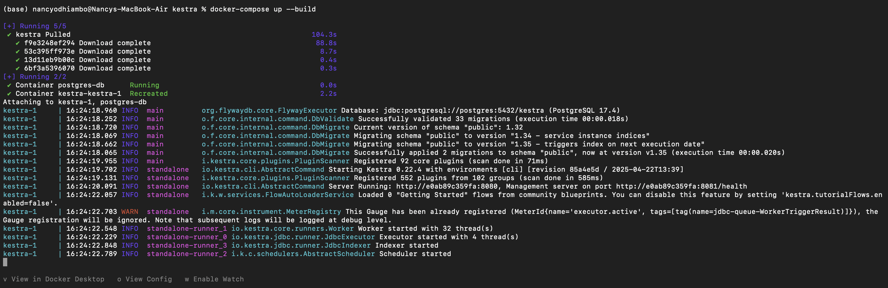
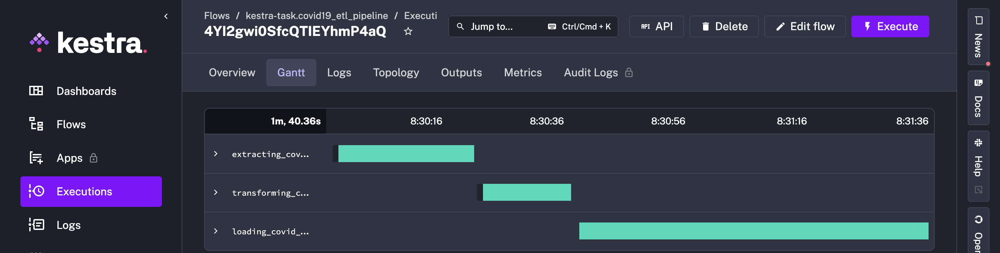
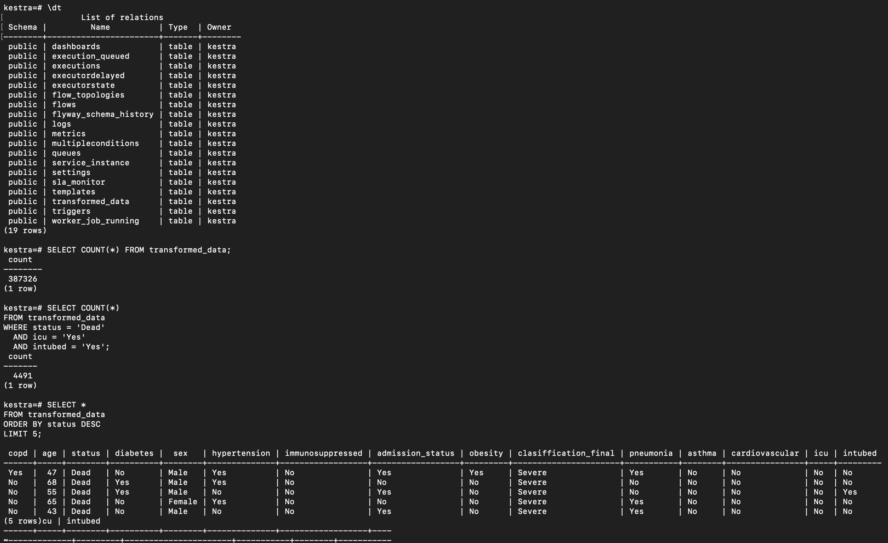
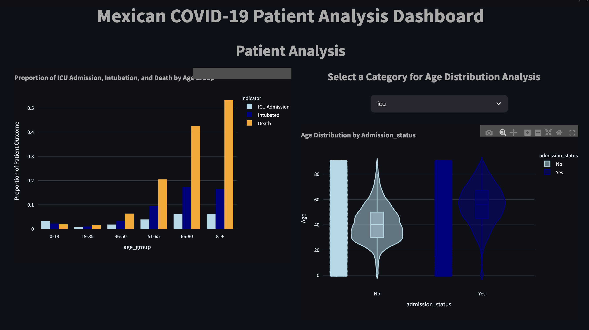
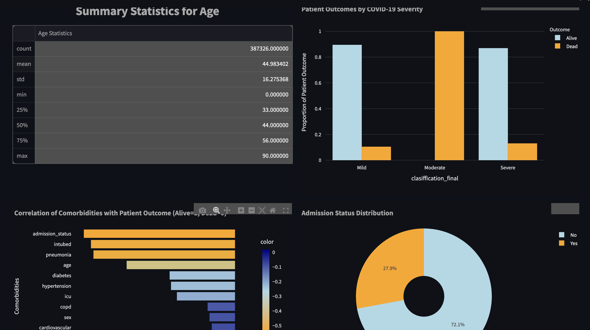
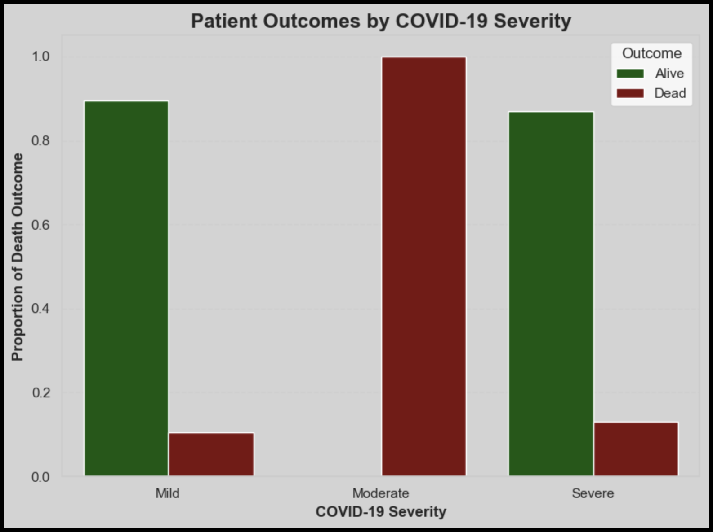
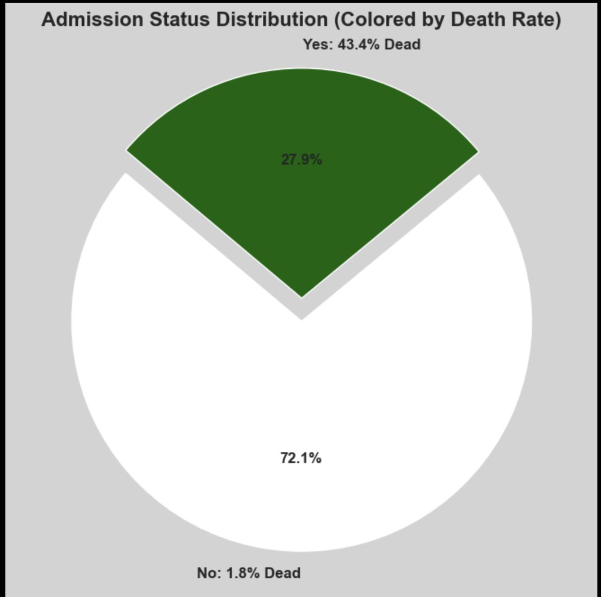

# 🦠 Mexican COVID-19 Patient Data ETL Analysis and Dashboard

## 📌 Project Title  
**Final Semester Project: Assessing Comorbidity and Demographic Influence on COVID-19 Patient Outcomes from the Mexican Government Dataset through Automated ETL, Data Analysis and Visualization**

---

## 📂 Table of Contents
- [Project Overview](#project-overview)
- [Software Setup](#software-setup)
- [ETL Process](#etl-process)
  - [Data Extraction](#data-extraction)
  - [Data Transformation](#data-transformation)
  - [Data Loading to PostgreSQL](#data-loading-to-postgresql)
- [Data Analysis and Visualization](#data-analysis-and-visualization)
- [Streamlit Dashboard](#streamlit-dashboard)
- [Key Insights](#key-insights)
- [Conclusion & Future Recommendations](#conclusion--future-recommendations)
- [Technologies Used](#technologies-used)
- [Project Structure](#project-structure)
- [License](#license)
- [Contact](#contact)

---

## 📊 Project Overview
This project automates the entire ETL process for the COVID-19 patient dataset from Kaggle. The primary focus is to assess how comorbidities and demographic factors influence patient outcomes. The pipeline handles:
- **Extraction:** Automated download via Kaggle API.
- **Transformation:** Data cleaning,renaming, encoding, mapping and outlier removal.
- **Loading:** Insertion of transformed data into a PostgreSQL database running in Docker.
- **Visualization:** Data analysis and interactive Streamlit dashboard for real-time insights.

The goal is to provide actionable insights for healthcare management, enhancing future pandemic responses.

---

## ⚙️ Software Setup
- **VS Code:** Python scripting, demo ETL pipeline.
- **Docker:** Containerization of PostgreSQL and Kestra.
- **Kestra:** Workflow orchestration for automation.
- **PostgreSQL:** Data storage.
- **Streamlit:** Interactive dashboard.
- **Kaggle API:** Secure dataset access.

---

## 🔄 ETL Process

### 🗂️ Data Extraction
- Automated extraction using Kaggle API.
- Python `requests` and `ZipFile` for secure download and extraction.
- Encoding handled with `'windows-1252'` to avoid character issues.
- Extracted file: `covid_data.csv`.

---

### 🧹 Data Transformation
- Cleaned and standardized column names.
- Mapped numeric-coded fields to human-readable labels (e.g., "1" → "Male").
- Removed unknown values and outliers using IQR for the `age` field.
- Filtered severity classification to retain only "Mild", "Moderate" and "Severe".
- Engineered features like `age_group` for better grouping and analysis.
- Created an encoded copy of the dataset for correlation analysis.

---

### 🗄️ Data Loading to PostgreSQL
- Database: **kestra** (containerized via Docker).
- Created `transformed_data` table.
- Inserted 387,326 cleaned rows (from initial 1,048,576) with 15 selected features.
- Used `psycopg2` for secure data insertion and connection handling.

---

## 📈 Data Analysis and Visualization
- Tools: SQLAlchemy, Pandas, Seaborn, Matplotlib.
- Focus:
  - ICU admission rates by age group.
  - Intubation rates by age.
  - Outcome (Alive/Dead) distribution by comorbidities and severity.
  - Correlation analysis between features and mortality.
  
---

## 🌐 Streamlit Dashboard
- **Dashboard Name:** Mexican COVID-19 Patient Analysis Dashboard.
- Built using **Streamlit** with PostgreSQL as the data source.
- Visualizations powered by **Plotly** for interactivity.
- Features:
  - Severity outcomes by patient status.
  - Age-related outcome distributions.
  - Comorbidity correlations with mortality.
  - Dropdown filters for interactive selection.

## 📸 Dashboard and Visualizations

### 🌐 Streamlit Dashboard Overview

### 🧪 Severity Outcome Visualization

### 🔥 Correlation Heatmap

---

## 💡 Key Insights
- Older patients had higher ICU admission, intubation, and death rates.
- Patients with **moderate severity** surprisingly had higher death rates than those with severe classification—potentially due to gaps in intervention.
- **Admission status** strongly correlated with death, followed by intubation, pneumonia and comorbidities like diabetes and hypertension.
- The pie chart analysis showed 27.9% were admitted, while 72.1% received home-based care.

---

## ✅ Conclusion & Future Recommendations
- Prioritize care for elderly patients with existing comorbidities.
- Monitor **moderate severity** cases closely as they may require more intervention.
- Strengthen infrastructure for ICU and intubation support.
- Consider similar ETL and analysis strategies for future outbreaks.

---

## 🛠️ Technologies Used
- **Python:** Pandas, SQLAlchemy, Psycopg2, Plotly, Streamlit.
- **PostgreSQL:** Data storage.
- **Docker:** Containerization of services.
- **Kestra:** Workflow automation.
- **Kaggle API:** Data extraction.

---

